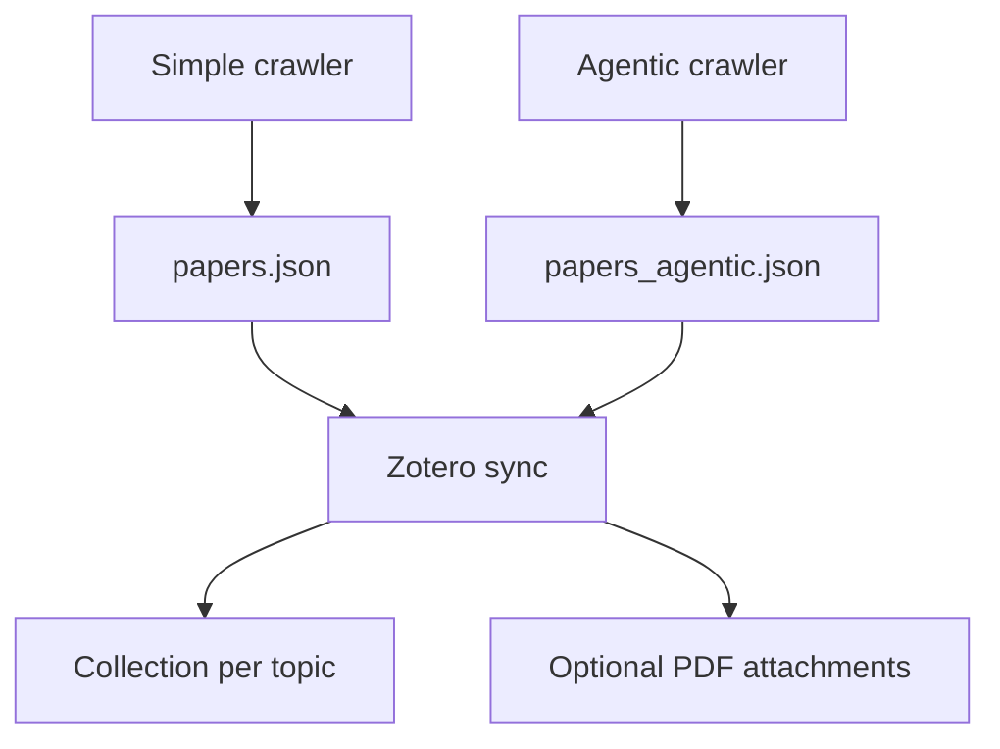

# BioAgentHub Crawler

Lightweight literature crawler to fetch open-access papers for any topic.
- Sources: Europe PMC + bioRxiv.
- Downloads PDFs with fallbacks (Europe PMC render, PMC OA, Unpaywall, DOI redirects).
- Simple crawler uses only HTTP requests (no LLM).
- Agentic crawler uses CrewAI plus optional OpenAI embeddings/cross-encoder scoring.

## Environment setup
```bash
cd /taiga/illinois/eng/chbe/zhao5/vikas/iBF/BioAgentHub_Crawler
python -m venv .venv
source .venv/bin/activate
pip install -e .
pip install -e ".[dev]"
```
If you prefer the old-style install:
```bash
pip install -r requirements.txt
```
Note: `requirements.txt` uses a local wheel for CrewAI. For packaging/editable installs, deps are read from `requirements-packaging.txt` (uses PyPI `crewai==0.5.0`).
Optional (only if you want the Gradio UI):
```bash
pip install -e ".[gradio]"
```

## Quickstart (agentic by default)
```bash
bioagenthub-crawl \
  --brief "Find PETase engineering papers focused on thermostability and activity" \
  --max-results 10 \
  --downloads 0 \
  --output agentic_outputs \
  --config agentic_config.yaml
```
Simple mode (no LLM):
```bash
bioagenthub-crawl --mode simple --query "PETase depolymerase" --max 5 --download 1 --out crawler_outputs
```
Alternative (without console script, simple mode):
```bash
python simple_crawl.py --query "PETase depolymerase" --max 5 --download 1 --out crawler_outputs
```
Outputs are stored under `crawler_outputs/run_<timestamp>/`:
- `papers.json` — merged & deduplicated metadata.
- `download_log.json` — status for attempted PDF downloads.
- PDFs for any successful downloads.

### Simple CLI parameters (simple_crawl.py)
- `--query` (required): search query string.
- `--anchor` (optional): hard filter; required term in title/abstract.
- `--max` (default: 10): max results per source (Europe PMC + bioRxiv).
- `--download` (default: 1): how many PDFs to attempt.
- `--out` (default: `crawler_outputs`): output root; a `run_<timestamp>` folder is created.
- `--zotero-collection` (optional): override the Zotero collection name.
- `--no-zotero` (flag): disable Zotero sync for this run.
- `--with-pdf` (flag): attach PDFs to Zotero when available (default metadata-only).
- `--no-zotero-local-dedupe` (flag): disable local dedupe/cache.
- `--no-zotero-remote-dedupe` (flag): disable Zotero remote dedupe.
- `--gatekeeper` (default: `skip`): `skip`, `refresh`, or `off` for pre-crawl Zotero checks.

## Agentic crawler (CrewAI workflow)
### Requirements
- **OpenAI provider (default):** set `OPENAI_API_KEY` or the agentic run will fail.
- **Ollama provider:** set `llm.provider: ollama` in config and ensure Ollama is running (no OpenAI key needed for the agent LLM).
- **Embeddings/cross-encoder:** require OpenAI access; disable via config if you do not want them.

### Example run
```bash
bioagenthub-agentic \
  --brief "Find PETase engineering papers focused on thermostability and activity" \
  --max-results 8 \
  --downloads 2 \
  --min-queries 4 \
  --max-queries 10 \
  --target-papers 12 \
  --output agentic_outputs \
  --config agentic_config.yaml
```
Alternative (without console script):
```bash
python agentic_crawl.py \
  --brief "Find PETase engineering papers focused on thermostability and activity" \
  --max-results 8 \
  --downloads 2 \
  --min-queries 4 \
  --max-queries 10 \
  --target-papers 12 \
  --output agentic_outputs \
  --config agentic_config.yaml
```

### Agentic CLI parameters (agentic_crawl.py)
- `--brief` (required): research brief for the agents.
- `--max-results` (default: 8): used as **per-query cap** and **global cap** for the literature search tool; also used as fallback target count if `--target-papers` is not set.
- `--downloads` (default: 2): how many PDFs to attempt.
- `--min-queries` (default: 4): minimum number of query variants to generate.
- `--max-queries` (default: 12): maximum number of query variants to generate.
- `--target-papers` (default: unset): preferred minimum number of unique papers; if unset, uses `search.target_results` from config, else falls back to `--max-results`.
- `--recall-cap` (default: 40): max results per **recall** query.
- `--precision-cap` (default: 15): max results per **precision** query.
- `--require-primary-anchor` (flag): force the primary anchor as a hard filter for every search call.
- `--model` (default: `OPENAI_MODEL` or `gpt-4o-mini`): agent LLM model if `llm.model` is not set in config.
- `--output` (default: `agentic_outputs`): output root; a `agentic_run_<timestamp>` folder is created.
- `--config` (default: `agentic_config.yaml`): YAML config path; if missing, defaults are used.
- `--verbose` (flag): enable verbose CrewAI logs.
- `--zotero-collection` (optional): override the Zotero collection name.
- `--no-zotero` (flag): disable Zotero sync for this run.
- `--with-pdf` (flag): attach PDFs to Zotero when available (default metadata-only).
- `--no-zotero-local-dedupe` (flag): disable local dedupe/cache.
- `--no-zotero-remote-dedupe` (flag): disable Zotero remote dedupe.
- `--gatekeeper` (default: `skip`): `skip`, `refresh`, or `off` for pre-crawl Zotero checks.

### Agentic outputs
Each run creates:
```
agentic_outputs/
  agentic_run_<timestamp>/
    papers_agentic.json     # deduped metadata + scores
    agentic_summary.json    # full agent outputs + diagnostics + usage + zotero
    pdfs/
      download_log.json
      0001_<pmid>_<title>.pdf
      0002_<pmid>_<title>.pdf
```

### Agentic config (agentic_config.yaml)
Copy the example file and edit:
```bash
cp agentic_config.example.yaml agentic_config.yaml
```
Fields in the config file:
- `llm.provider`: `openai` (default) or `ollama`.
- `llm.model`: model name for the provider.
- `llm.base_url`: only used when `llm.provider=ollama`.
- `agents.<name>.temperature`: per-agent temperature overrides. Valid names: `query`, `search`, `pdf`, `summarizer`, `query_rerank`, `pdf_rerank`, `validator`.
- `search.target_results`: preferred minimum number of unique papers if `--target-papers` is not set.
- `scoring.enable_embeddings`: enable OpenAI embeddings.
- `scoring.enable_cross_encoder`: enable OpenAI cross-encoder scoring.
- `scoring.cross_encoder_top_n`: max papers to score with the cross-encoder.
- `scoring.embedding_model`: OpenAI embedding model name.
- `scoring.cross_encoder_model`: OpenAI chat model name for relevance scoring.
- `scoring.weights_path`: path to `scoring_weights.json` (softmax weights).
  - If unset, a packaged default is used for installed builds. For custom weights, point this to your local file.

## Console scripts
Installed via `pip install -e .`:
- `bioagenthub-crawl` (defaults to agentic; add `--mode simple` to use the simple crawler)
- `bioagenthub-simple`
- `bioagenthub-agentic`
- `bioagenthub-api`
- `bioagenthub-gradio`
- `bioagenthub-weights`
- `bioagenthub-zotero`

## FastAPI server
### Start the API server
```bash
bioagenthub-api --host 0.0.0.0 --port 8005 --reload
```
Alternative (uvicorn directly):
```bash
uvicorn api_server:app --host 0.0.0.0 --port 8005 --reload
```
Open the built-in HTML UI at `http://127.0.0.1:8005/`.
Swagger UI is available at `http://127.0.0.1:8005/docs` and ReDoc at `http://127.0.0.1:8005/redoc`.

### Endpoints
#### `GET /health`
- **Input**: none
- **Output**: `{"status":"ok"}`

#### `POST /crawl/simple`
- **Input JSON**:
  - `query` (string, required): search query.
  - `max_results` (int, default 10): max results per source.
  - `anchor` (string, optional): hard filter in title/abstract.
  - `download_count` (int, default 1): PDFs to attempt.
  - `output_root` (string, default `crawler_outputs`): output root.
  - `run_name` (string, optional): fixed run folder name.
- **Output JSON**:
  - `run_dir`: full path to run folder.
  - `result.metadata`: path to `papers.json`.
  - `result.downloads`: path to `download_log.json`.
  - `result.count`: number of unique papers.
  - `table`: preview with `title`, `doi`, `link`, `authors`.

Example:
```bash
curl -X POST http://127.0.0.1:8005/crawl/simple \
  -H "Content-Type: application/json" \
  -d '{"query":"PETase depolymerase","max_results":5,"download_count":1,"output_root":"crawler_outputs"}'
```

#### `POST /crawl/agentic`
- **Input JSON**:
  - `brief` (string, required)
  - `max_results` (int, default 8)
  - `downloads` (int, default 2)
  - `min_queries` (int, default 4)
  - `max_queries` (int, default 12)
  - `target_papers` (int, optional)
  - `recall_cap` (int, default 40)
  - `precision_cap` (int, default 15)
  - `require_primary_anchor` (bool, default false)
  - `model` (string, default `gpt-4o-mini`)
  - `output_root` (string, default `agentic_outputs`)
  - `config_path` (string, default `agentic_config.yaml`)
  - `verbose` (bool, default false)
- **Output JSON**:
  - `run_dir`: full path to run folder.
  - `result.search.metadata_path`: path to `papers_agentic.json`.
  - `result.downloads.log_path`: path to `pdfs/download_log.json`.
  - `result.summary_path`: path to `agentic_summary.json`.
  - `table`: preview with `title`, `doi`, `link`, `authors`.

#### Streaming endpoints
- `POST /crawl/simple/stream`
- `POST /crawl/agentic/stream`

These return JSON lines with events: `start`, `done`, or `error`.

## Gradio UI (optional)
```bash
bioagenthub-gradio --host 0.0.0.0 --port 7862
```
Alternative (without console script):
```bash
python gradio_crawler.py --host 0.0.0.0 --port 7862
```
CLI flags:
- `--host` (default: `127.0.0.1`)
- `--port` (default: `7862`)
- `--share` (flag): enable a public share link.

The UI can call a running API server (set the API URL field), or run locally if no API is reachable.

## Core concepts (query vs anchor)
- **Query:** the full search string sent to Europe PMC / bioRxiv (e.g., `"PETase AND thermostability AND mutagenesis"`).
- **Anchor:** a required term filter applied after retrieving candidates; if absent in title/abstract, the record is dropped.

## Agentic expansion: what does `PRIMARY_ANCHOR AND "phrase"` mean?
- Phrases are mined from titles + abstracts of already retrieved papers.
- The pipeline extracts frequent bigrams/trigrams and method phrases, then builds expansion queries like:
  - `PETase AND "directed evolution"`
  - `PETase AND "structure guided design"`

## Relevance scoring (how it’s computed)
Each paper gets up to three component scores:
1) **Token score**: overlap between query/anchors and title/abstract/journal/category.
2) **Embedding score** (optional): cosine similarity between the brief and title+abstract.
3) **Cross-encoder score** (optional): OpenAI model relevance judgement.

Final score is a softmax-weighted blend using `scoring_weights.json`.

## Offline re-training (learn_weights.py)
`learn_weights.py` trains the softmax weights for the final score.
```bash
python learn_weights.py --data data/relevance_labels.jsonl --epochs 200 --lr 0.05 --out scoring_weights.json
```
Parameters:
- `--data` (required): JSONL/NDJSON or CSV with `token_score`, `embed_score`, `cross_encoder_score`, `label` (0/1), optional `weight`.
- `--epochs` (default: 200): gradient-descent epochs.
- `--lr` (default: 0.05): learning rate.
- `--out` (default: `scoring_weights.json`): output file.
- `--init` (optional): initial theta JSON.
- `--clip` (default: 5.0): gradient clipping.
- `--min-samples` (default: 10): minimum samples required.
- `--verbose` (flag): print per-epoch metrics.

## Environment variables
**Zotero API key is required** to sync papers to a library.
- Copy `.env.example` to `.env` and fill in your values (do not commit `.env`).
- `OPENAI_API_KEY`: required for agentic runs when `llm.provider=openai`.
- `OPENAI_MODEL`: default OpenAI model for agents/cross-encoder (can be overridden by `--model` and config).
- `OPENAI_EMBED_MODEL`: default embedding model for scoring.
- `BIORXIV_DAYS_BACK`: lookback window (days) for bioRxiv searches; default 730.
- `ZOTERO_API_KEY`: API key with write access to your Zotero library.
- `ZOTERO_LIBRARY_TYPE`: `group` or `user` (default `group`).
- `ZOTERO_GROUP_ID`: group library ID (required if library type is `group`). Default in this repo: `6443780` (`ibiofoundry-ai_petase`).
- `ZOTERO_GROUP_ID_SECONDARY`: optional secondary group ID to sync to both libraries (default in this repo: `6443907`).
- `ZOTERO_USER_ID`: user library ID (required if library type is `user`).
- `ZOTERO_COLLECTION_PREFIX`: prefix used when creating collections (default empty string; no prefix).
- `ZOTERO_CACHE_DIR`: local cache directory for dedupe across runs (default `.zotero_cache`).

## Zotero integration
Zotero does not allow creating new libraries via API. Instead, this repo creates a collection per topic or project inside your group library. This keeps all papers organized under one group while still separating projects.

**Users must provide their own Zotero API key** (and set the group or user library IDs) to enable sync.

Default behavior is metadata-only sync. PDFs are attached only when you enable `--with-pdf` and downloads exist.



### Zotero sync behavior
- Collection name: `<topic>` by default (prefix optional via `ZOTERO_COLLECTION_PREFIX` or `--zotero-collection`).
- PETase runs are normalized to **collection name `PETase`** to avoid duplicate collections.
- Dedupe: local cache plus optional remote lookups by DOI/PMID/title.
- Local cache: stored in `ZOTERO_CACHE_DIR` to avoid re-adding items across runs.
- Gatekeeper: pre-crawl check can skip runs if the query contains an existing collection name. Use `--gatekeeper refresh` to always crawl.

### Zotero CLI
`bioagenthub-zotero` subcommands:
- `health`: check Zotero connectivity.
- `collections`: list collections.
- `items`: list items in a collection or library.
- `search`: search items by query.
- `get`: fetch a single item by key.
- `sync`: push a metadata JSON file into a collection.
- `dedupe`: merge and dedupe multiple metadata JSON files.

Example:
```bash
bioagenthub-zotero sync \
  --metadata crawler_outputs/run_20250225_120000/papers.json \
  --topic "PETase project" \
  --with-pdf
```

### Zotero API endpoints
- `GET /zotero/health`
- `GET /zotero/collections`
- `GET /zotero/items?collection_key=<key>&limit=<n>&start=<n>`
- `GET /zotero/item/<item_key>`
- `GET /zotero/search?query=<q>&collection_key=<key>`
- `POST /zotero/sync`
- `POST /zotero/dedupe`

`POST /zotero/sync` JSON:
- `metadata_path` (required): path to metadata JSON list.
- `topic` (required): project/topic name.
- `download_log_path` (optional): PDF download log.
- `pdf_dir` (optional): directory for PDFs.
- `collection_override` (optional): override collection name.
- `with_pdf` (optional): attach PDFs when available.
- `no_dedupe_local` (optional): disable local cache dedupe.
- `no_dedupe_remote` (optional): disable remote dedupe.

### Post-processing and multi-run dedupe
Use `bioagenthub-zotero dedupe` (or `POST /zotero/dedupe`) to merge multiple metadata files across runs and remove redundancy before syncing.

## Usage tracking
Agentic runs now emit:
- `usage`: best-effort token usage (if available from the LLM provider).
- `stats.runtime_sec`: end-to-end runtime for the run.

## New modules
- `zotero_sync.py`: core sync logic, collection management, optional PDF attachments, and dedupe cache.
- `zotero_library.py`: read/write helpers for collections, items, and searches.
- `zotero_cli.py`: CLI wrapper for health, search, sync, and dedupe.
- `postprocess.py`: merge and dedupe multiple metadata files across runs.
- `usage_tracker.py`: LLM usage tracking for agentic runs.
- `crawl_runner.py`: unified entrypoint that defaults to agentic; use `--mode simple` to switch.

## Simple vs agentic comparison
Use this as a high-level comparison when deciding which mode to run:

| Dimension | Simple crawler | Agentic crawler |
| --- | --- | --- |
| Speed | Fast (single pass queries) | Slower (multi-agent + reranking) |
| Compute | Low | High (LLM + optional embeddings) |
| Cost | Low | Higher (LLM calls) |
| Quality | Good for broad OA recall | Better precision and ranking |
| Best use | Quick sweeps, OA-only | Curated, high-quality runs |

For actual numbers, compare the `stats.runtime_sec` and `usage` outputs across your runs.

## SSH port forwarding (cluster usage)
If running on a cluster node, forward ports to your laptop:
```bash
ssh -L 8005:127.0.0.1:8005 -L 7862:127.0.0.1:7862 <user>@<cluster-host>
```
Then open:
- API + UI: `http://127.0.0.1:8005/`
- Swagger UI: `http://127.0.0.1:8005/docs`
- ReDoc: `http://127.0.0.1:8005/redoc`
- Gradio UI (if running): `http://127.0.0.1:7862/`

## Testing
Quick check:
```bash
pytest -q
```
Suggested protocol:
```bash
pip install -e ".[dev]"
pytest
pytest --cov=. --cov-report=term-missing
```
If you see pytest plugin import errors in a shared environment, rerun with:
```bash
PYTEST_DISABLE_PLUGIN_AUTOLOAD=1 pytest -q
```
Live integration tests (external network + OpenAI):
```bash
RUN_LIVE_INTEGRATION=1 pytest -m integration
```
Note: `OPENAI_API_KEY` must be set to run the agentic integration test.
Manual checks:
- `bioagenthub-crawl --mode simple --query "test" --max 1 --download 0`
- `bioagenthub-api --host 127.0.0.1 --port 8005` and open `http://127.0.0.1:8005/docs`
- `bioagenthub-gradio --host 127.0.0.1 --port 7862` (optional)
Capability smoke tests (no external calls):
- `bioagenthub-crawl --help`
- `bioagenthub-agentic --help`
- `bioagenthub-api --help`
- `bioagenthub-gradio --help`
- `bioagenthub-weights --help`

Known warnings:
- Pydantic v2 deprecation warnings from CrewAI (class-based config, V1/V2 mixing). These are upstream and do not affect test pass/fail.
- Gradio may warn about `python_multipart` import deprecation and `bottleneck` version; these are dependency warnings and do not affect test pass/fail.

## Sample outputs (real run)
The `sample_outputs/` folder contains real output from a live run:
```bash
bioagenthub-crawl --mode simple --query "PETase depolymerase" --max 2 --download 1 --out crawler_outputs
```
Included files:
- `sample_outputs/papers.json` (real metadata)
- `sample_outputs/download_log.json` (download status)
- `sample_outputs/README.md` (provenance)

Downloaded PDFs are excluded from the repo to avoid licensing issues; they are generated at runtime.
